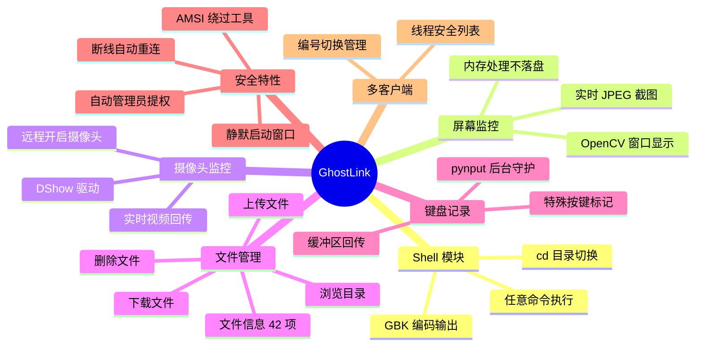

# GhostLink - 远程管理工具包

欢迎来到 **GhostLink** 的 Wiki！

GhostLink 是一个基于 Python 的轻量级远程管理工具包（RAT），支持 Shell 命令执行、屏幕实时监控、摄像头画面采集、文件系统管理、键盘记录以及文件上传功能。

> ⚠️ **免责声明**：本项目仅供安全研究和教育用途，请勿用于未经授权的访问。使用者需遵守当地法律法规，自行承担所有责任。

---

## 快速导航

| 页面 | 内容 |
| --- | --- |
| [快速入门](Getting-Started) | 环境配置、依赖安装、首次运行 |
| [用户指南](User-Guide) | 所有功能的详细操作说明 |
| [协议参考](Protocol-Reference) | TCP 通信协议的完整规范 |
| [架构说明](Architecture) | 代码架构、线程模型、设计思路 |
| [常见问题](FAQ) | 常见问题与排错指南 |

---

## 功能一览



## 项目结构

```text
GhostLink/
├── 后台.py           # 控制端 - 管理菜单与显示
├── 客户端.py         # 被控端 - 执行命令与回传数据
├── 启动.bat          # 一键启动脚本
├── KillAMSI.cpp      # AMSI 绕过工具 (C++)
├── README.md         # 项目说明
├── LICENSE           # MIT 许可证
├── requirements.txt  # Python 依赖清单
├── wiki/             # Wiki 文档
└── GhostLink.wiki/   # GitHub Wiki 镜像
```

## 快速开始

```bash
# 1. 安装依赖
pip install -r requirements.txt

# 2. 修改客户端目标 IP（客户端.py 第 21 行）
IP, PORT = '192.168.0.103', 4444

# 3. 启动控制端
python 后台.py

# 4. 启动被控端
python 客户端.py
```
