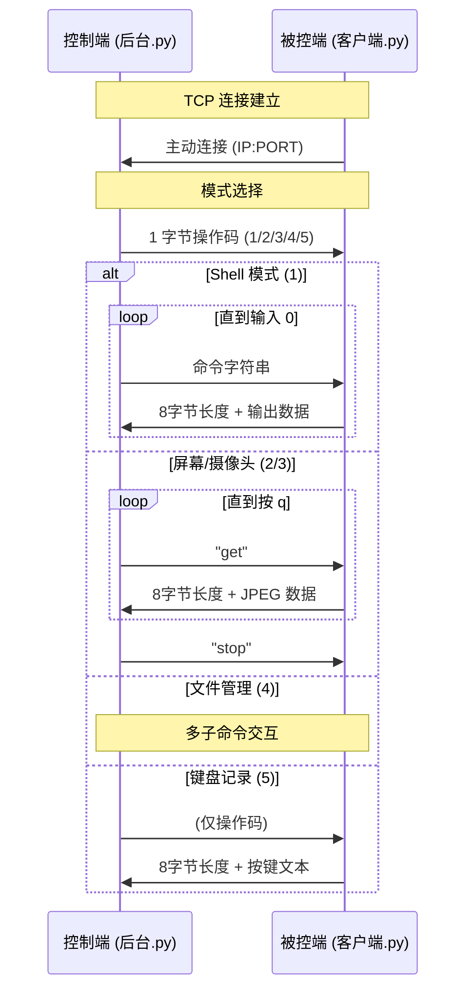

# 协议参考

本文档定义了 GhostLink 控制端与被控端之间的 TCP 通信协议。

---

## 协议总览



---

## 数据帧格式

### 请求帧（控制端 → 被控端）

| 阶段 | 内容 | 长度 |
| --- | --- | --- |
| 模式选择 | 单字节操作码 | 1 字节 |
| 子命令 | ASCII 字符串 | 不定长（由 `recv(1024)` 接收） |

### 响应帧（被控端 → 控制端）

| 字段 | 格式 | 长度 |
| --- | --- | --- |
| 长度头 | 8 位十进制数字（不足左侧补零） | 8 字节 |
| 数据体 | 原始字节 | 由长度头指定 |

**示例**：

```text
00000124<124字节的实际数据>
00000000<空数据>
-0000001<错误标识>
```

---

## 操作码定义

| 操作码 | 模块 | 子命令 | 数据方向 | 编码 |
| --- | --- | --- | --- | --- |
| `1` | Shell | 任意命令；`0` 退出 | C→S: GBK 文本 | `gbk` |
| `2` | 屏幕监控 | `get` 请求帧；`stop` 停止 | C→S: JPEG 字节流 | `binary` |
| `3` | 摄像头监控 | `get` 请求帧；`stop` 停止 | C→S: JPEG 字节流 | `binary` |
| `4` | 文件管理 | 见下方详细协议 | 双向 | 混合 |
| `5` | 键盘记录 | 无子命令（单次触发） | C→S: UTF-8 文本 | `utf-8` |

---

## 模块 1：Shell 协议

```text
S → C: "1"                           # 进入 Shell 模式
S → C: "whoami"                      # 发送命令
C → S: "00000150desktop-xxx\admin..." # 8位长度 + GBK 输出
S → C: "0"                           # 退出
```

`cd` 命令由客户端本地拦截处理：

```python
if cmd.startswith('cd '):
    os.chdir(cmd[3:].strip())
    output = f"CWD: {os.getcwd()}"
```

---

## 模块 2/3：屏幕/摄像头协议

```text
S → C: "2"          # 进入屏幕模式
S → C: "get"        # 请求一帧
C → S: "00012345<JPEG bytes>"
S → C: "get"        # 请求下一帧
...
S → C: "stop"       # 停止
```

| 参数 | 屏幕 (2) | 摄像头 (3) |
| --- | --- | --- |
| 截图源 | `ImageGrab.grab()` | `cv2.VideoCapture(0)` |
| 格式 | JPEG quality=30 | JPEG quality=50 |
| 无画面时 | 不发送（空帧） | 发送空字节 `b''` |

---

## 模块 4：文件管理协议

### 4.1 进入与磁盘列表

```text
S → C: "4"
C → S: "00000030C:\D:\E:\"           # 磁盘列表
```

### 4.2 浏览目录 (look)

```text
S → C: "look C:\Windows"
C → S: "00001024<pickle 序列化的文件名列表>"
```

> 文件列表使用 `pickle.dumps()` 序列化以保留 Unicode 文件名。

### 4.3 下载文件 (get)

```text
S → C: "get C:\secret.txt"
C → S: "00001024"                    # 文件大小（-1 = 失败）
S → C: "ok"                          # 确认接收
C → S: <1024 字节文件数据>
```

### 4.4 删除文件 (delete)

```text
S → C: "delete C:\log.txt"
# 无响应（静默执行）
```

### 4.5 文件信息 (information)

```text
S → C: "information C:\app.exe"
C → S: "00005678<GBK 编码的元数据文本>"
```

返回格式见 [文件信息字段](#文件信息字段)。

### 4.6 上传文件 (send)

```text
S → C: "send C:\target\dir"
C → S: "READY"                       # 客户端就绪（5 字节）
S → C: "00000012payload.exe"         # 8位文件名长度 + 文件名
C → S: "OK"                          # 确认文件名（2 字节）
S → C: "00001024"                    # 8位文件大小
C → S: "OK"                          # 确认（2 字节）
S → C: <1024 字节文件数据>
C → S: "SUCCESS"                     # 完成确认（7 字节）
```

错误信号：

- `-0000001`（8 字节）→ 服务端取消
- `ERROR`（7 字节）→ 客户端接收异常

### 4.7 退出

```text
S → C: "0"
```

---

## 模块 5：键盘记录协议

```text
S → C: "5"                           # 请求键盘记录
C → S: "00000500<UTF-8 按键文本>"    # 最多 500 条
```

按键记录格式：

```text
2026-05-30 14:23:01: H
2026-05-30 14:23:01: e
2026-05-30 14:23:02: [enter]
2026-05-30 14:23:03: [shift]
```

- 普通字符直接记录
- 特殊键标记：`[enter]`、`[shift]`、`[ctrl]`、`[alt]`、`[tab]`、`[backspace]` 等
- 缓冲区在回传后自动清空

---

## 错误处理

| 场景 | 处理方式 |
| --- | --- |
| 命令执行失败 | 返回 `stderr` 内容或异常消息 |
| 文件不存在 | 返回 8 字节 `-0000001` |
| 权限不足 | 返回 GBK 文本 `"权限不足"` |
| 连接断开 | 抛出 `ConnectionError`，控制端清理客户端列表 |
| 摄像头失败 | 发送空字节 `b''`，不中断连接 |

---

## 文件信息字段

`information` 命令返回 42 项文件/文件系统元数据：

| # | 字段 | 说明 |
| --- | --- | --- |
| 1 | 类型 | 文件 / 文件夹 |
| 2 | 文件大小 | 字节数 |
| 3 | 创建时间 | `os.path.getctime` |
| 4 | 修改时间 | `os.path.getmtime` |
| 5 | 访问时间 | `os.path.getatime` |
| 6 | 文件权限 | 八进制 POSIX 权限位 |
| 7 | inode 号 | 文件系统 inode |
| 8 | 硬链接数 | 硬链接计数 |
| 9 | 属性值(原始) | Windows 文件属性原始值 |
| 10 | SHA256 哈希 | 文件内容哈希（仅文件） |
| 11 | 所有者 | `DOMAIN\User` 格式 |
| 12 | 属性描述 | 人类可读的属性标志 |
| 13 | 完整路径 | 绝对路径 |
| 14 | 扩展名 | 文件扩展名 |
| 15 | 短路径名(8.3) | DOS 8.3 格式路径 |
| 16 | 符号链接目标 | （如适用） |
| 17 | 文件魔数(hex) | 前 16 字节十六进制 |
| 18 | 文件魔数(文本) | 前 16 字节 ASCII 视图 |
| 19 | MIME 类型 | 基于扩展名推测 |
| 20 | 磁盘卷标 | 所在磁盘卷标名 |
| 21 | 磁盘序列号 | 卷序列号 |
| 22 | 文件系统 | NTFS/FAT32 等 |
| 23 | 文件系统特性 | 区分大小写/Unicode/ACL/压缩/加密 |
| 24-31 | 版本信息 | PE 文件版本、公司、描述等 |
| 32 | DOS 属性标记 | R/H/S/D/A/N 标记 |
| 33 | 所在目录 | 父目录路径 |
| 34 | 文件名 | 纯文件名 |
| 35 | 设备号 | `st_dev` |
| 36 | 索引号 | `st_ino` |
| 37 | NTFS 文件引用号(MFT) | 64 位 MFT 条目号 |
| 38 | NTFS 链接数 | NTFS 硬链接数 |
| 39 | NTFS 卷序列号 | NTFS 卷序列号 |
| 40 | ADS 数据流 | NTFS 备用数据流列表 |
| 41-42 | 文件图标 | 系统图标索引 + Base64 PNG |
